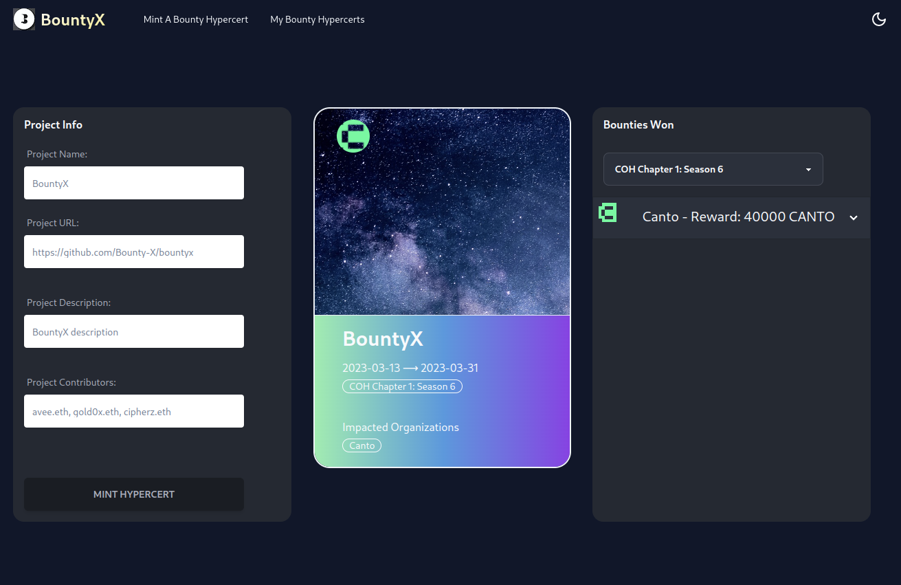

# **BountyX**

## Bounty was just the beginning of your project. Keep building and multiply your impact.

Repo: **https://github.com/Bounty-X/bountyx**

## BountyX is a way for Web3 builders to celebrate winning a bounty and keep building their project as a public good after the hackathon is over.

## **Motivation**

- Starting new projects is hard, especially if it is a public good

- Getting fairly rewarded for you impact is even harder

- How do we attract more talent working on public goods

- People have a lot of bright ideas and their realization often starts at - hackathons, but the development usually get stalled after it’s over for a number of reasons

- Almost all Web3 hackathon projects start as public goods

## **How It Works**

- BountyX is built on top of Hypercerts. Hypercert is an NFT implementation of Impact Certificate that allows you to show your contributions to the world and receive rewards retroactively for creating positive impact.

- If you won a bounty at a hackathon, you may be eligible to mint a Hypercert, distribute it between the team members and bounty issuers.

- The bounty can be matched retroactively by the beneficiaries of your impact

- Get access to the community and “next-step” features

## **“Next-Step” Features (In the future)**

- Team chat between contributors and sponsors

- Create a Gitcoin project automatically from your Hypercert

- Share a fraction of the Hypercert on NFT marketplaces

## **Benefits**

- We incentivize public goods projects to continue building and stay public

- We help provide ways for projects to:
  => Receive retroactive funding
  => Receive recognition
  => Collaborate in the future
